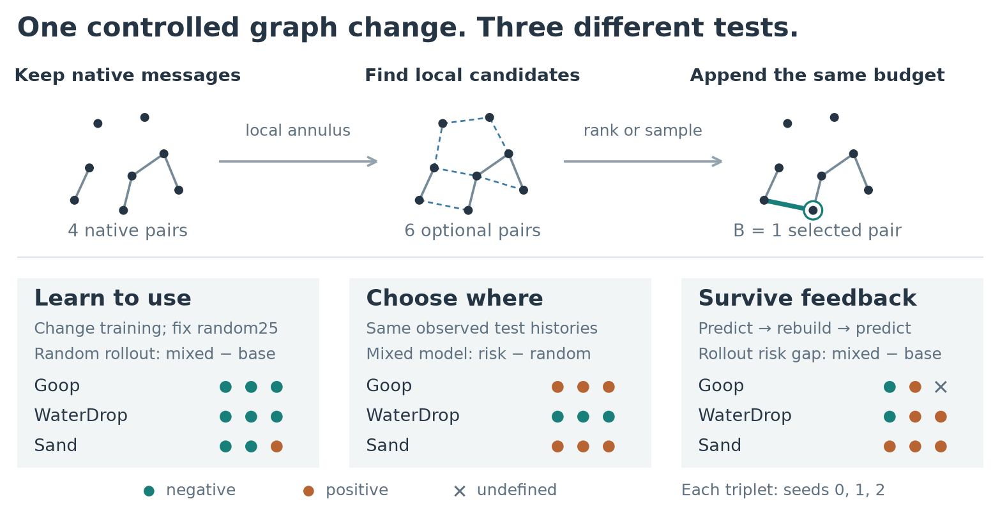

# Adaptive Interaction Graphs for Particle Simulation

Code, saved scientific results and manuscript sources for studying three distinct questions: whether a simulator learns to use extra messages, whether a score places those messages effectively on a common state, and whether the benefit survives autonomous feedback.



The method keeps every native edge and adds a fixed budget of nearby particle pairs. Mixed-graph training teaches the simulator to use extra messages; cached residual scores determine where to place them. The experiments separate these choices: learning to use an expansion can help even when residual-guided placement does not outperform random placement.

## Reproduce the paper from saved results

Python 3.12 and Matplotlib are sufficient; the tables also work with the Python standard library alone.

```sh
python -m pip install -r requirements-figures.txt
python reproduce.py --output generated
python -m unittest discover -s tests -v
```

The command produces three figures in PNG, SVG and LaTeX, together with the complete primary, physical-diagnostic and Goop3D observed tables. It retains all 34 primary policy rows,34 physical/cost rows, three Goop guard cases, all displayed seed effects and undefined means. Inputs are decimal/scalar records and saved particle glyphs; this command does not rerun simulations.

```sh
python reproduce.py --tables-only --output generated
python paper/build.py --output generated/manuscript.tex
```

Read [the manuscript](paper/revised_manuscript.tex), [result definitions](results/README.md), and [experimental settings](protocols/README.md). The paper source is standalone LaTeX; the builder reconstructs the same source from its editable components.

## Train and evaluate simulations

Install the scientific dependencies in a separate environment and choose the appropriate PyTorch build. The reported Goop/Sand training profile is Python 3.12, PyTorch 2.13.0+cu129, CUDA 12.9 and NVIDIA GB200, with deterministic algorithms, two CPU threads and TF32 disabled. WaterDrop uses Apple MPS. These hardware profiles are distinct; matching a recipe on another numerical stack does not imply identical optimization.

```sh
python -m pip install -r requirements-science.txt
python code/portable/train_portable.py --dataset goop --frozen-dir code/studies --check-source-equivalence
python code/portable/train_portable.py --dataset sand --frozen-dir code/studies --check-source-equivalence
python code/evaluate.py --help
```

[Training and evaluation commands](code/README.md) use explicit local data, checkpoint and output paths. Goop/Sand training preserves the complete fixed 100k optimizer loop and graph/noise schedules. The portable evaluation entry calls the same native rollout and observed-history functions. The lightweight tests check source/configuration preservation and synthetic metadata; full training and real-checkpoint evaluation through these portable wrappers have not been executed for this distribution.

Raw datasets and trained checkpoints are not included. [Data requirements](code/DATA.md) describe the numeric manifest format and official source identities. Retraining requires separately obtained data; evaluating the saved models requires separately obtained checkpoints with matching hashes. Saved-result reproduction above works without them.

## What the results contain

The primary comparisons are paired base-only and mixed training at seeds 0–2: fresh100k Goop and Sand, and WaterDrop 100k→110k continuation. The Goop3D 25k observed extension and the faithful/NLL objective, action-benefit and self-message controls have their own scopes. They are not pooled. Failure accounting uses full declared denominators, and reported seed SDs are descriptive rather than confidence intervals. Physical boundary diagnostics and measured cost remain distinct from computational guards and accuracy.

The source license and required upstream GNS attribution are in [LICENSE](LICENSE), [upstream license](code/adaptive-gns/license.md) and [upstream authors](code/adaptive-gns/AUTHORS.md). The software license does not grant rights to separately obtained datasets or checkpoints. Dataset papers and the model/method references are cited in the manuscript.
