# The paper's argument

```mermaid
flowchart TD
    A["A simulator communicates through a local particle graph"] --> B["Can a small budget of extra interactions improve prediction?"]
    B --> C["Construct the intervention<br/>Keep the native graph and append a fixed number of nearby pairs"]
    C --> D["1. Learn to use the messages<br/>Compare matched training with and without graph exposure<br/>Keep the evaluation policy fixed"]
    D --> E["Fixed-random rollouts improve in every Goop and WaterDrop seed<br/>Sand improves in two of three"]
    E --> F["2. Choose useful messages<br/>Hold model and observed history fixed<br/>Compare residual-guided placement with random placement"]
    F --> G["Risk does not consistently beat random<br/>Goop and Sand retain a deficit<br/>WaterDrop improves on test, not consistently on validation"]
    G --> H["Why the gap?<br/>Predicting error is different from predicting<br/>how much an added interaction will reduce it"]
    H --> I["3. Test the feedback loop<br/>Let each policy predict its own next input and graph"]
    I --> J["Observed gains need not survive<br/>Sand cached-risk worsens after exposure<br/>Goop full-risk comparison is limited by graph-size guards"]
    J --> K["Useful adaptation requires all three:<br/>training support, useful placement, and reliable feedback"]
    K --> L["Particle views add a final caution:<br/>lower position error does not establish realistic motion"]
```

Goop3D is an additional observed-history check at a shorter training endpoint. Its existing autonomous completion is still running, so it is not used to complete the argument above. The main conclusions use the already completed studies and retain Goop's undefined full-horizon risk comparison.

The appendix supports this argument with protocol details, full policy comparisons, failure accounting, and short derivations. Historical implementation audits, tangential pilots, operational records, and exhaustive redundant tables belong in the preserved research repository, not in the paper's reading path.
